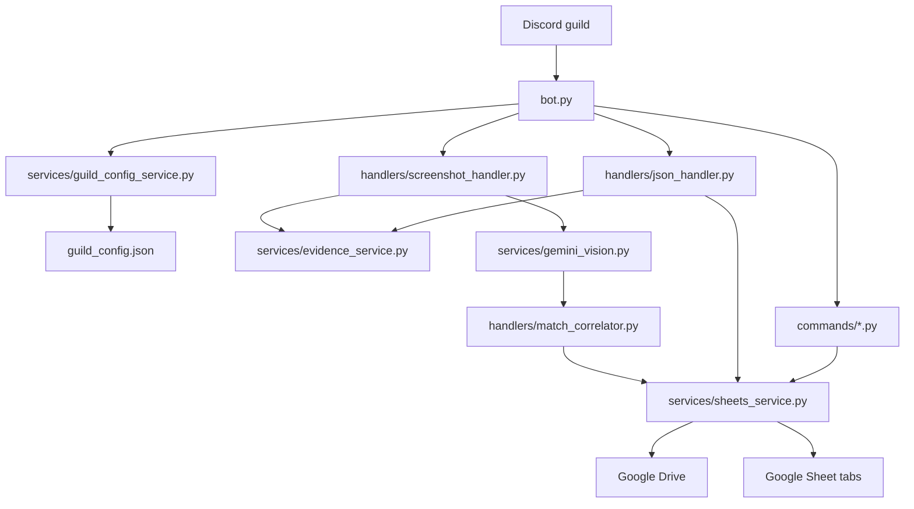

# ForgeLens

## Overview

ForgeLens is a Discord bot for Smite 2 draft leagues. It turns match evidence - player screenshots and optional GodForge Draft JSON - into organized, reviewable season stats in a league-owned Google Sheet.

Players upload screenshots. GodForge can post draft exports. ForgeLens reads the evidence, sends screenshots to Gemini Vision, records match and stat rows, tracks duplicate evidence, and gives stat admins slash commands for season setup, match IDs, linking, reparsing, status checks, and result confirmation.

ForgeLens is the stats companion, not the live match-ops bot. GodForge owns live drafting, randomization, match orchestration, and its current betting/ledger system. ForgeLens owns evidence intake, OCR parsing, normalized stat rows, review state, and reporting/export surfaces.

## Current Status

ForgeLens is an active MVP with a recent guild-scoping hardening pass. It now supports guild-scoped active seasons, match rows, evidence rows, player stat rows, unlinked evidence, and stat-admin configuration through `guild_config.json` plus `Guild ID` columns in the season sheet.

It is still not a finished full production stat platform. Current hardening is focused on keeping Discord servers from sharing active seasons or sheet rows. Deeper review tooling, field-level OCR confidence, player identity management, export workflows, and any future ledger module remain roadmap work.

Confirmed implementation status:

- Discord slash commands are implemented in `commands/`.
- `/forgelens setup` and `/forgelens config` are implemented for MVP guild setup and inspection.
- Screenshot ingestion, Gemini parsing, duplicate evidence detection, and unlinked handling are implemented.
- GodForge Draft JSON ingestion is implemented as match enrichment.
- Google Sheets/Drive are the current operational storage/export surface.
- Per-guild config is JSON-backed in `guild_config.json`.
- A legacy `active_season.json` can be migrated into guild config on first read.
- Betting/ledger is not implemented in this repo and remains live in GodForge.

## Core Features

### Evidence Intake

- Watches each guild's configured screenshot channel for image attachments.
- Watches each guild's configured JSON drop channel for GodForge Draft JSON files.
- Ignores DMs and bot-authored messages.
- Accepts PNG, JPEG/JPG, GIF, and WebP screenshots.
- Computes SHA-256 fingerprints for screenshot bytes and normalized JSON payloads.
- Records evidence metadata in the `Evidence` sheet tab.
- Ignores duplicate evidence for the same `guild_id + match_id + fingerprint`.

### Screenshot OCR

- Sends screenshots to Gemini 2.0 Flash through `services/gemini_vision.py`.
- Prompts Gemini to classify each image as `scoreboard` or `details`.
- Merges scoreboard god/role data with details stat data by player-name matching.
- Writes parsed stats to `Player Stats` when a match ID is present.
- Marks partial screenshots as `review_required`.
- Saves screenshots without a match ID to `Unlinked`.
- Adds fuzzy hints for unlinked uploads by comparing parsed player names to existing unlinked rows.

### GodForge Draft JSON

- Reads `.json` attachments in the configured JSON channel.
- Requires a `draft_id`.
- Supports a `games` array or a flat single-game export shape.
- Appends picks, bans, captains, fearless pool, game status, and evidence fingerprint to `Match Log`.
- Treats Draft JSON as optional match enrichment, not as official stats or a final result.

### Guild-Scoped Seasons And Config

- `guild_config.json` stores per-guild active season and bootstrap configuration.
- `Guild ID` is written into Match Log, Player Stats, Unlinked, Evidence, and Season Config data.
- Commands resolve active season and permissions by `interaction.guild_id`.
- Existing `active_season.json` can be imported into a guild's active season as a compatibility bridge.

### Staff Workflows

- Stat admins can create seasons and match IDs.
- Staff can link an unlabelled screenshot to a match ID.
- Staff can re-run OCR for a screenshot message.
- Staff can confirm a reviewed result with `/result`.
- `/status` reports game rows, match lifecycle status, stat row count, winner, and score.

## Architecture / System Flow



Runtime flow:

1. `bot.py` loads guild config for the message's Discord server.
2. Messages in the configured screenshot channel go to `handle_screenshot_message`.
3. Messages in the configured JSON channel go to `handle_json_message`.
4. Screenshot bytes or JSON payloads are fingerprinted for duplicate checks.
5. Screenshot OCR rows are merged and written to `Player Stats`, or saved to `Unlinked` when no match ID is present.
6. Draft JSON rows are written to `Match Log`.
7. Commands read and update the active sheet for the current guild.

## Commands / Usage

| Command | Who Uses It | Confirmed Behavior |
| --- | --- | --- |
| `/forgelens setup screenshot_channel: json_channel: admin_channel: stat_admin_role: league_prefix: parent_drive_folder_id: confidence_threshold:` | Discord admin or stat admin | Configures the current guild and replies with a setup summary plus the next `/newseason` step. |
| `/forgelens config` | Discord admin or stat admin | Shows the current ForgeLens config for the current guild. |
| `/newseason name:` | Stat admin | Creates a Drive folder and Google Sheet, creates/updates the guild active season, and writes the season schema. |
| `/newmatch blue_captain: red_captain:` | Stat admin | Generates a `LEAGUE_PREFIX-XXXX` match ID and appends a guild-scoped `created` row to `Match Log`. |
| `/status uid:` | Stat admin | Shows game rows, match status, stat row count, winner, and score for the current guild. |
| `/link uid:` | Stat admin | Reply-based command that removes a matching row from `Unlinked`, creates a match shell if needed, appends parsed stats, and marks the match `parsed`. |
| `/reparse` | Stat admin | Reply-based command that removes an old unlinked row for the message and sends screenshots through Gemini again. |
| `/result uid: winner: score:` | Stat admin | Updates matching guild-scoped Match Log rows and marks the match `confirmed`. |

Passive usage:

- Players post screenshots in the screenshot channel with a match ID in the message or filename.
- GodForge posts Draft JSON in the JSON drop channel.
- Unlabelled screenshots are saved to `Unlinked`; staff reply to the original screenshot and run `/link`.
- Partial or duplicate evidence is reported to the configured admin report channel.

## Setup

Start with [SETUP.md](SETUP.md) for the full Google Cloud and Railway walkthrough.

### Prerequisites

- Python 3.12, matching `runtime.txt`.
- Discord bot token with Message Content Intent enabled.
- A screenshot channel, JSON drop channel, and admin report channel.
- At least one stat-admin Discord role ID or user ID.
- Google Cloud project with Gemini API, Google Sheets API, and Google Drive API enabled.
- Google service-account credentials.
- Gemini API key.
- Optional parent Google Drive folder for season folders.

### Install

```bash
git clone https://github.com/diese-tech/smite2-stat-bot.git
cd smite2-stat-bot
pip install -r requirements.txt
```

### Configure

Create a `.env` file for local development:

```text
DISCORD_TOKEN=your_discord_bot_token
GOOGLE_CREDENTIALS_PATH=credentials.json
GEMINI_API_KEY=your_gemini_api_key

SCREENSHOT_CHANNEL_ID=123456789
JSON_CHANNEL_ID=123456789
ADMIN_REPORT_CHANNEL_ID=123456789
STAFF_ROLE_IDS=123456789,987654321
STAT_ADMIN_USER_IDS=

LEAGUE_PREFIX=FRH
CONFIDENCE_THRESHOLD=90
BETTING_ENABLED=false
PARENT_DRIVE_FOLDER_ID=optional_google_drive_folder_id
```

`config.py` still contains default league identity constants:

```python
LEAGUE_NAME = "Frank's Retirement Home"
LEAGUE_SLUG = "franks-retirement-home"
```

Those constants are used as bootstrap defaults. Per-guild runtime settings are stored in `guild_config.json`; run `/forgelens setup` to set the active Discord channels, stat admin role, match ID prefix, Drive folder, and confidence threshold for a server.

### Verify Auth

```bash
python test_auth.py
```

Do not run the bot for a real league until this passes.

### Run Locally

```bash
python bot.py
```

On startup, ForgeLens syncs slash commands. If a guild has no active season, run `/newseason`.

### Deploy

`Procfile` runs:

```text
worker: python bot.py
```

For Railway, use environment variables instead of `.env`. Use `GOOGLE_CREDENTIALS_JSON` for service-account credentials; `config.py` writes it to a temporary file and points `GOOGLE_CREDENTIALS_PATH` at it during startup.

## Environment Variables

| Variable | Required | Purpose |
| --- | --- | --- |
| `DISCORD_TOKEN` | Yes | Discord bot token. |
| `SCREENSHOT_CHANNEL_ID` | Bootstrap recommended | Default screenshot channel ID used when a guild has no saved override. Optional at import time. |
| `JSON_CHANNEL_ID` | Bootstrap recommended | Default GodForge JSON drop channel ID used when a guild has no saved override. Optional at import time. |
| `ADMIN_REPORT_CHANNEL_ID` | Bootstrap recommended | Default admin-report channel ID. If unset and no guild config exists, admin notices are skipped. |
| `STAFF_ROLE_IDS` | Recommended | Comma-separated role IDs allowed to use stat-admin commands by default. |
| `STAT_ADMIN_USER_IDS` | Optional | Comma-separated user IDs allowed to use stat-admin commands by default. |
| `CONFIDENCE_THRESHOLD` | Optional | Default review threshold stored in config/season metadata. Defaults to `90`; field-level confidence is not fully implemented yet. |
| `BETTING_ENABLED` | Optional | Parsed as a boolean default, but guild bootstrap currently stores betting as disabled. Verify before any ledger work. |
| `GOOGLE_CREDENTIALS_PATH` | Local yes unless using JSON env | Path to service-account JSON. Defaults to `franks-retirement-home-credentials.json`. |
| `GOOGLE_CREDENTIALS_JSON` | Hosted alternative | Full service-account JSON blob for hosts that cannot mount a file. |
| `GEMINI_API_KEY` | Yes | Gemini API key used by `google-genai`. |
| `PARENT_DRIVE_FOLDER_ID` | Optional | Default parent Drive folder for season folders. |
| `LEAGUE_PREFIX` | Optional | Prefix for `/newmatch` IDs. Defaults to `FRH`. |

## Storage And Sheet Structure

Local files:

| File | Purpose |
| --- | --- |
| `guild_config.json` | Per-guild config, active season pointers, channel IDs, admin IDs, threshold, and Drive parent defaults. Created automatically. |
| `active_season.json` | Legacy active-season file. If present, it can be migrated into a guild entry on first lookup. |

Each season Google Sheet contains:

| Tab | What It Contains |
| --- | --- |
| `Match Log` | Match IDs, captains, picks, bans, fearless pool, game status, result, guild ID, lifecycle status, evidence fingerprints, review notes. |
| `Player Stats` | One row per parsed player with stats, guild ID, match status, evidence fingerprint, confidence, and review notes. |
| `Unlinked` | Screenshots uploaded without a match ID, plus guild ID, evidence fingerprint, and fuzzy match candidate. |
| `Season Config` | Season metadata, guild ID, confidence threshold, betting flag, timestamps, game count, and bot version. |
| `Evidence` | Evidence fingerprints and metadata for screenshot/Draft JSON duplicate protection. |

Supported match statuses in code:

```text
created
evidence_uploaded
parsed
review_required
confirmed
official
exported
archived
```

## Operational Notes

- ForgeLens commands must be used inside a Discord server; DM commands are rejected.
- `guild_config.json` is JSON-backed local state. On ephemeral hosts, make sure it persists or supply bootstrap env values and recreate active seasons as needed.
- `/forgelens setup` can be run by Discord administrators or already-configured stat admins, which prevents first-run lockout when no stat admin role is configured yet.
- `/forgelens setup` is an MVP setup flow, not a full production admin console. It writes the main guild config fields but does not validate Google Drive access.
- `on_ready` currently calls each command module's `setup` before syncing slash commands.
- Screenshot OCR keeps one `scoreboard` and one `details` result from a message. Multiple attachments of the same type can overwrite the previous in-memory result for that message.
- Screenshot-derived game numbers are currently blank because the correlator does not assign game order.
- `append_player_stats` increments `Total Games Logged` each time stats rows are appended; this is not the same as a fully reviewed game count.
- `/result` confirms Match Log rows and updates Player Stats match status, but it does not calculate the `Win` column.
- Duplicate evidence checks require the same guild, match ID, and fingerprint. Unlabelled screenshots are not checked against a match ID until linked.
- Fuzzy matching is currently a hint for unlinked screenshots, not an automatic attachment.
- `get_exportable_player_stats` exists for `confirmed` and `official` rows, but no dedicated export command is implemented yet.
- High-confidence OCR is still evidence, not an official match result.
- Betting/ledger behavior is intentionally outside this repo today; GodForge's active betting system should not be removed or reframed as part of ForgeLens hardening.

## Known Issues / Refactor Targets

### Guild Scoping

- Recent code adds guild-scoped rows and active seasons, but Google credentials and default league identity are still process-level.
- `/forgelens setup` now covers the first-run config path, but granular edit commands for individual channels, admins, Drive folders, and thresholds are still pending.
- `guild_config.json` should move to durable storage before serious multi-server production use.

### Match Linkage And Season Behavior

- Match ID uniqueness is checked within the active sheet for the current guild, not in a durable database.
- Duplicate handling is fingerprint-based; near-duplicate screenshots are not detected unless fuzzy unlinked hints catch player overlap.
- Draft JSON can create/enrich match context, but screenshots create stats independently.
- Season creation switches the active season for one guild. Historical season browsing/export tooling is not implemented.

### OCR Reliability And Review

- Gemini responses do not include field-level confidence values today.
- `CONFIDENCE_THRESHOLD` is stored as config/metadata, but not yet used for per-field review decisions.
- Review state is represented by match status and notes, but there is no complete review queue UI/workflow.
- Player identity is still name-based; there is no guild-scoped player table, aliases, or Discord-user mapping.

### Ledger Boundary

- Ledger/betting is not implemented here.
- ADR 0003 requires separate match/stat and ledger lifecycles if a future ledger module is added.
- Future ledger resolution must require an official, stat-admin-confirmed match.

## Roadmap

- Expand `/forgelens setup` into granular config commands for guild-scoped channels, admins, confidence threshold, and export destinations.
- Move `guild_config.json` and sheet-derived state into durable storage.
- Add field-level confidence capture and review workflows.
- Add player identity, aliases, and optional Discord user mapping.
- Add stronger duplicate detection for `guild_id + match_id` and near-duplicate evidence.
- Add export/reporting commands around confirmed or official matches.
- Keep ledger support optional, disabled by default, and separated from stat confirmation.

## Contributing / Development Notes

Read these before implementation, debugging, migration, or production fixes:

- [SETUP.md](SETUP.md)
- [CONTEXT.md](CONTEXT.md)
- [MIGRATION_PLAN.md](MIGRATION_PLAN.md)
- [docs/AI_WORKFLOW_GUARDRAILS.md](docs/AI_WORKFLOW_GUARDRAILS.md)
- [docs/adr/0001-separate-godforge-from-forgelens-responsibilities.md](docs/adr/0001-separate-godforge-from-forgelens-responsibilities.md)
- [docs/adr/0002-scope-forgelens-data-by-discord-guild.md](docs/adr/0002-scope-forgelens-data-by-discord-guild.md)
- [docs/adr/0003-use-separate-match-and-ledger-lifecycles.md](docs/adr/0003-use-separate-match-and-ledger-lifecycles.md)

Development rules of thumb:

- Do not rewrite the bot from scratch.
- Preserve current screenshot intake, GodForge JSON intake, Gemini parsing, Sheets/Drive export, and slash command behavior unless a planned migration explicitly changes them.
- Keep every new persistent record scoped by `guild_id`.
- Treat Google Sheets/Drive as current operational storage and export output, while planning for a durable source of truth.
- Do not commit `.env`, credentials JSON, Discord tokens, or API keys.
- Do not migrate or delete GodForge betting/ledger behavior from this repo.

Run tests:

```bash
pytest
```

Run auth checks when Google credentials are configured:

```bash
python test_auth.py
```
